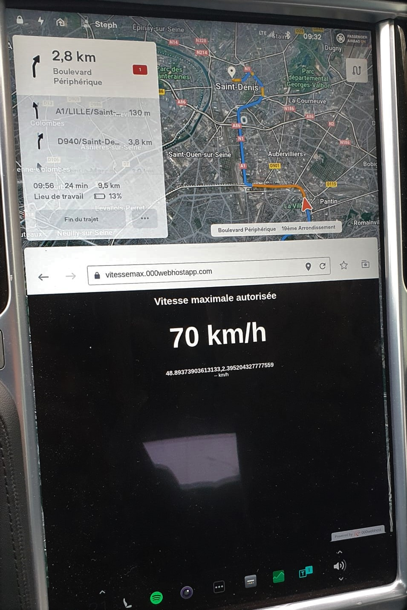
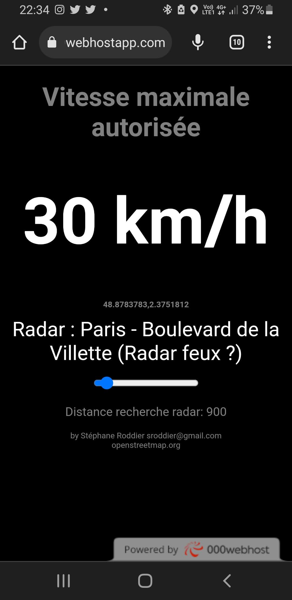

# Speed Limit Display README

## Introduction 

This project is a simple web page that displays the maximum speed limit at your current location, using data from OpenStreetMap. It also features a radar detection system where it notifies if there is a speed camera within a user-specified range.

 

## How it works

The web page retrieves your geolocation data and then sends a query to the Overpass API, which provides data from OpenStreetMap. The query looks for highway data around your current location and retrieves the maximum speed limit for that location.

The radar detection feature works similarly. It sends a query to the Overpass API, looking for radar data around your current location within a range that you can specify using a slider on the page.

The page refreshes every 4 seconds to update the displayed speed limit and radar data.

## Usage

To use the page, simply open it in a web browser. Make sure to allow the page to access your location data. The page will then display the maximum speed limit at your current location, and any radar within the specified range.

## License

This project is open source and available under the MIT License.

## Contact

If you have any questions or suggestions, feel free to reach out to Stéphane Roddier at sroddier@gmail.com.

---

# README Affichage de la limite de vitesse

## Introduction

Ce projet est une simple page web qui affiche la limite de vitesse maximale à votre emplacement actuel, en utilisant les données d'OpenStreetMap. Il dispose également d'un système de détection de radar qui signale s'il y a un radar de vitesse dans un rayon spécifié par l'utilisateur.

## Comment ça fonctionne

La page web récupère vos données de géolocalisation, puis envoie une requête à l'API Overpass, qui fournit des données d'OpenStreetMap. La requête cherche les données des autoroutes autour de votre emplacement actuel et récupère la limite de vitesse maximale pour cet emplacement.

La fonction de détection de radar fonctionne de manière similaire. Elle envoie une requête à l'API Overpass, à la recherche de données de radar autour de votre emplacement actuel dans un rayon que vous pouvez spécifier à l'aide d'un curseur sur la page.

La page se rafraîchit toutes les 4 secondes pour mettre à jour la limite de vitesse affichée et les données du radar.

## Utilisation

Pour utiliser la page, il suffit de l'ouvrir dans un navigateur web. Assurez-vous d'autoriser la page à accéder à vos données de localisation. La page affichera alors la limite de vitesse maximale à votre emplacement actuel, et tout radar dans le rayon spécifié.

## Licence

Ce projet est open source et disponible sous la licence MIT.

## Contact

Si vous avez des questions ou des suggestions, n'hésitez pas à contacter Stéphane Roddier à sroddier@gmail.com.
